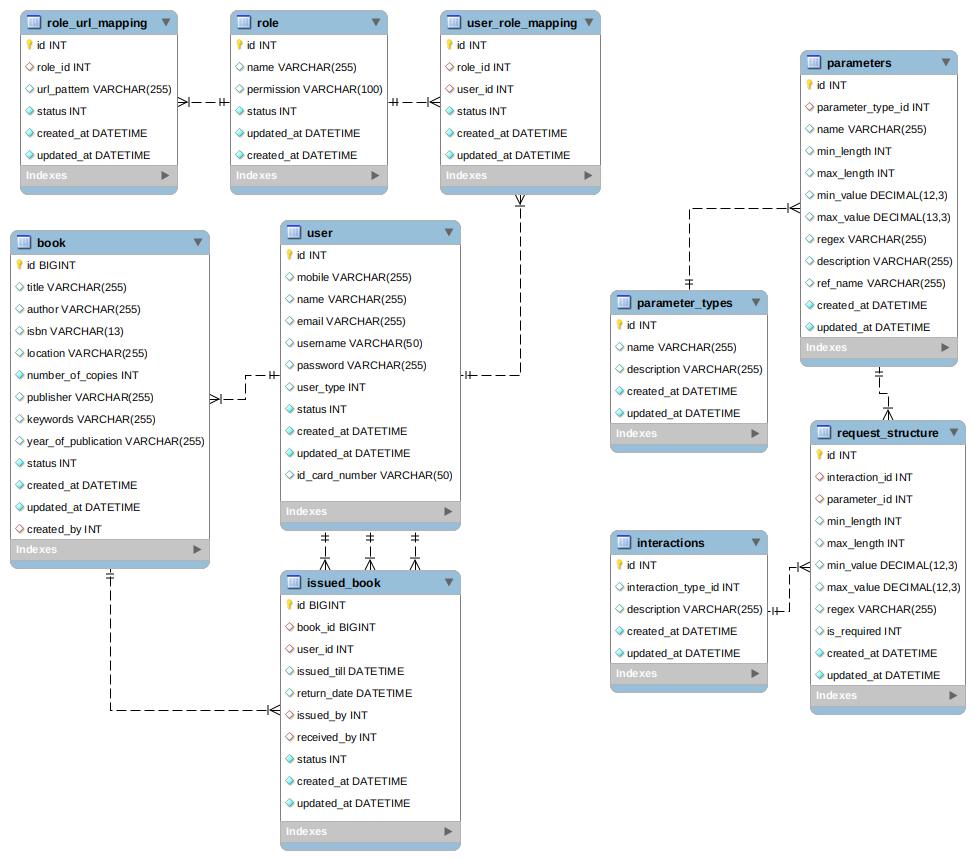
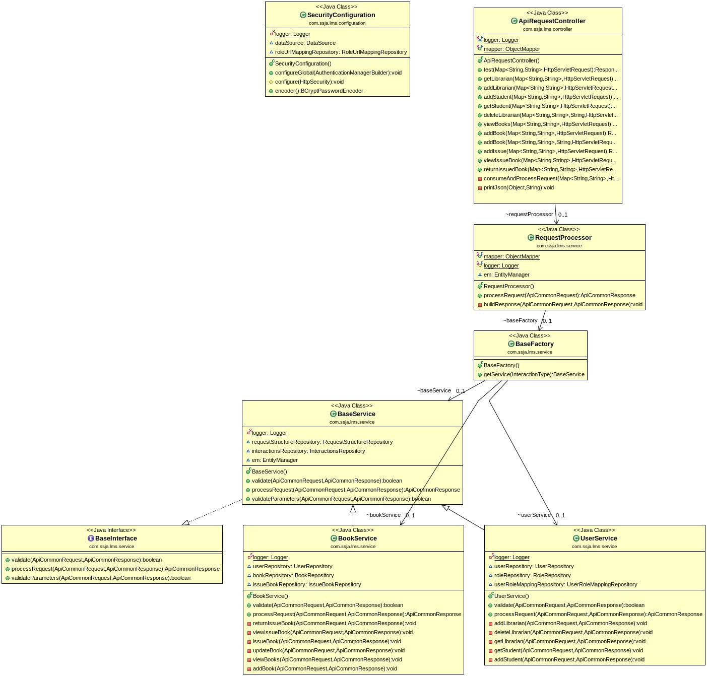

# Library Management System

## Tech Stack
* Java 8
* Springboot 2.2.6.RELEASE
* MySql 8

## Core Functionalities
* Add librarian
* View librarian
* Delete librarian
* Add Book
* View Books
* Add Student
* Issue Book
* Return Book

## Step to setup
* Create Database with name library
* Login to db and source db.sql file
[Database file](src/main/resources/db.sql)
* Make db related changes in application.yml file (username,password etc.)
* Navite to lms folder
* execute command :
    mvn clean package
* Navigte to target folder
* Run using :  java -jar lms-0.0.1-SNAPSHOT.jar
* Postman API Collection 
[Click here](https://www.getpostman.com/collections/97138c31f0ee01a8f070)
* Basic authentication needed to call the API, use username : admin and password : admin (you can add librarian using add libraian api and use librarian credentials for further apis)

## ER Diagram DB Schema

## Class Diagram (Important Classes)

